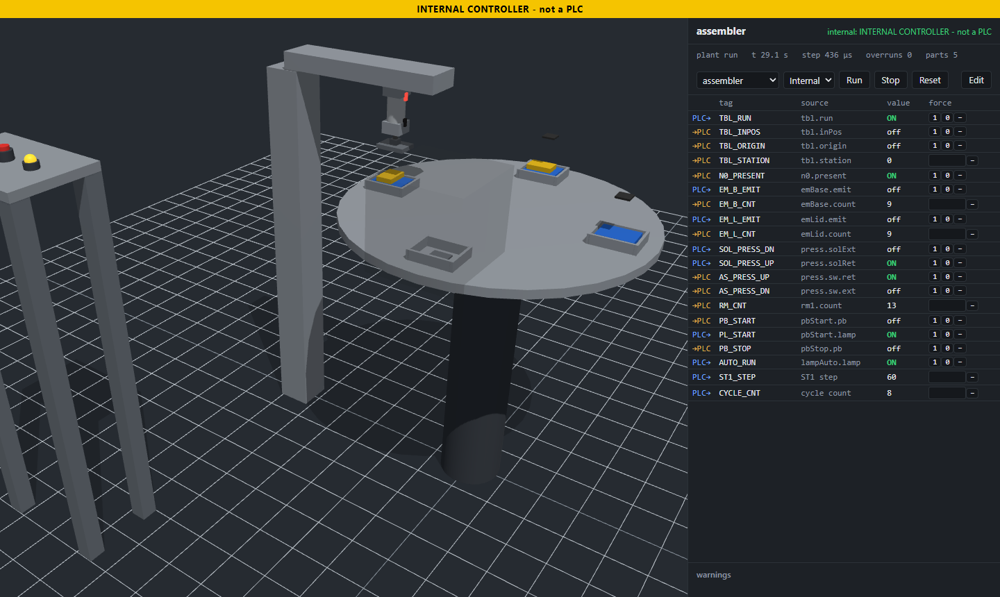
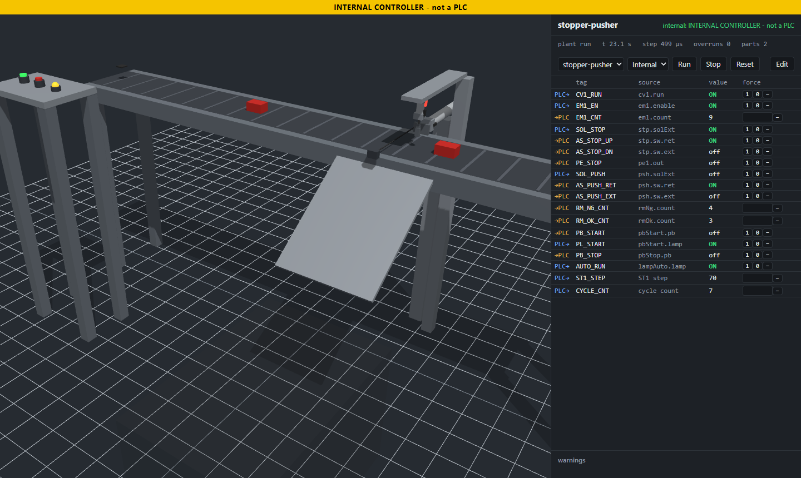
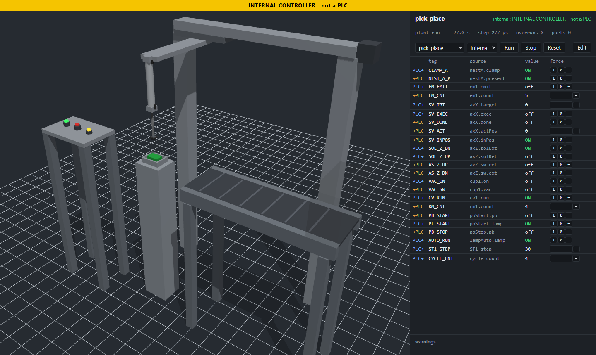
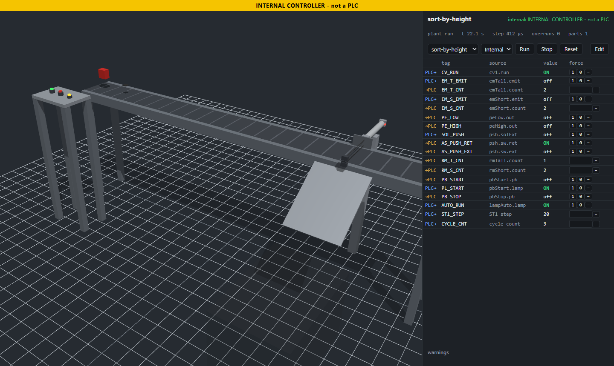
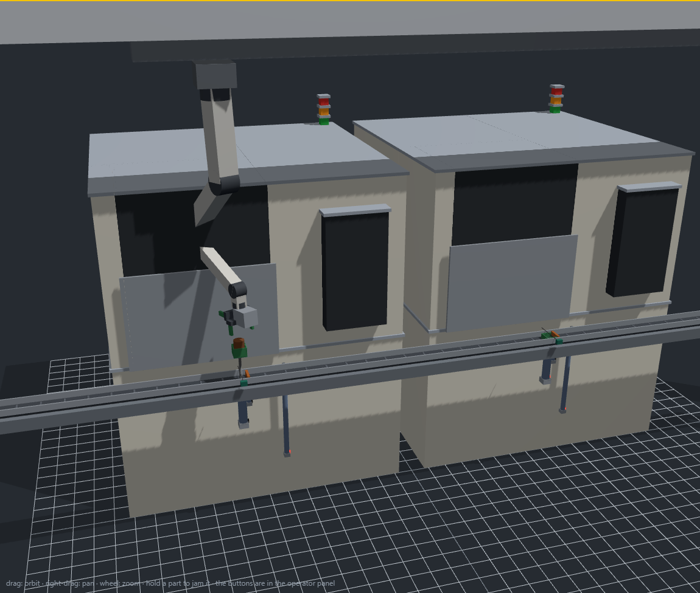
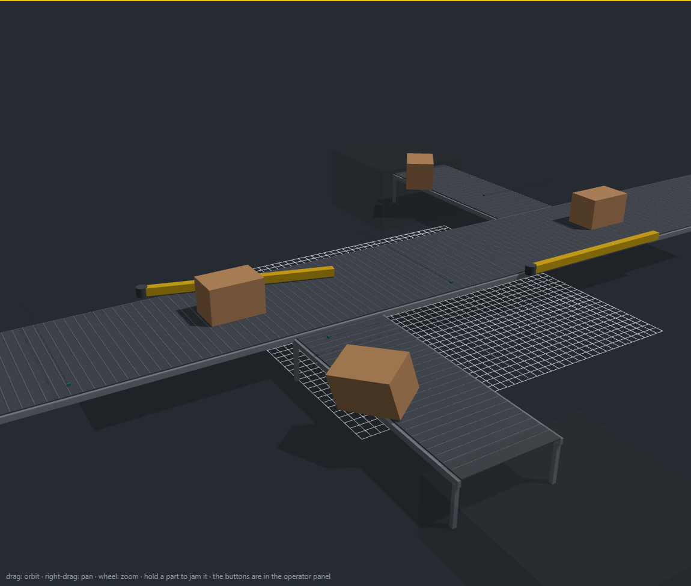
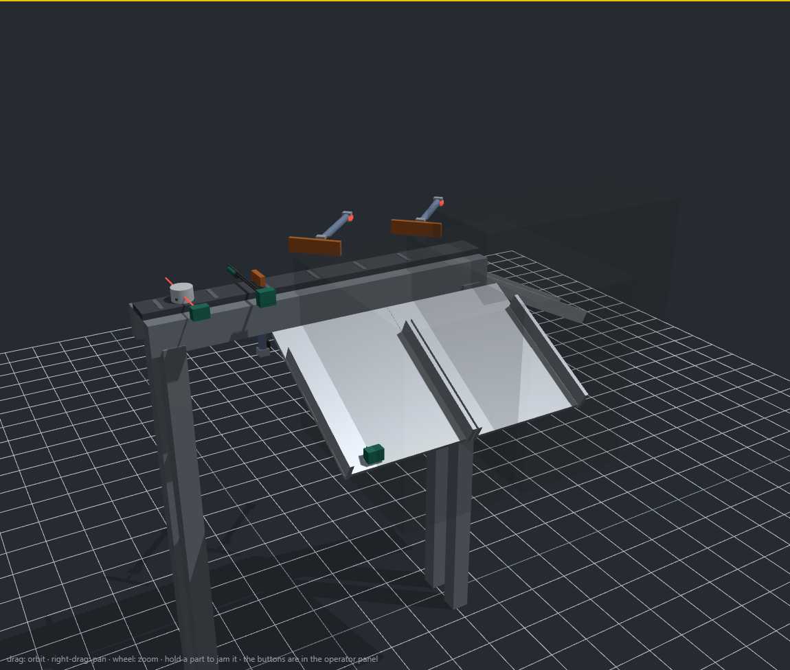
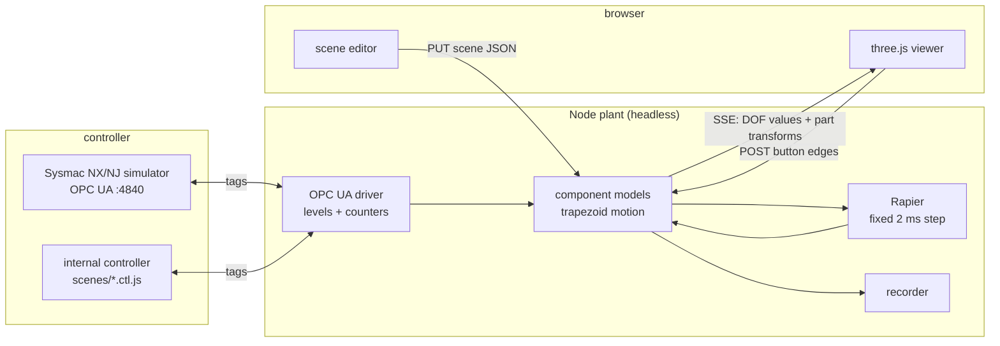

# manufacturing_io

A browser 3D plant simulator for **special purpose machines**, driven by a **real PLC program**.

The plant runs headless in Node (Rapier, fixed 2 ms step). The browser renders, edits and
measures it. The controller is either the **Omron Sysmac NX/NJ simulator over OPC UA**, or a small
internal controller so the scenes run with no PLC installed.



*The `assembler` scene, running on its own PLC program. Every tag the program reads or writes is
on the right, live, and forceable.*

## Quick start

```bash
npm install
node server/main.js --scene assembler --internal    # http://127.0.0.1:7660/
```

Press **Run**, then click the green **START** button in the 3D view. The scene picker and the
Internal/PLC switch change scene or controller without restarting.

```bash
node tests/run.js                                   # the whole suite, no framework
node tools/gen_sysmac.js --scene a-to-b             # scenes/a-to-b.sysmac.xml, to import into Studio
node tools/smc2.js plc/PROJECT.smc2 --scene a-to-b  # or straight into your own CLOSED project: globals, program, task
node server/main.js --scene a-to-b                  # the same scene against the simulator (opc.tcp://127.0.0.1:4840)
```

## What it does

- **Parts are parametric.** A cylinder takes bore, stroke, acting type and speed; reed switches
  sit at adjustable positions on the tube. A cylinder mounts on a servo slide, a gripper on the
  rod end, and each part moves with whatever it is attached to.
- **Workpieces are real physics.** They fall, ride belts on friction, queue against stoppers, get
  pushed down chutes and trip photo-eyes. Actuators stay kinematic: physics never decides the
  sequence and never writes to the PLC.
- **Jam it on purpose.** Click and hold a part in the 3D view and it stops dead where it is: the
  belt slips under it, the parts behind it queue up, and you watch what the PLC program does about
  it. Drag to move it — out of a gripper, off a belt, back into a nest. A part taken out of a
  holder makes that holder's switch go false, so the machine runs its cycle with an empty gripper
  and has to notice. Forcing a tag lies to the PLC; this breaks the material flow instead.
- **Walk into the cell.** Press *Walk in* (or F) and you are standing on the shop floor at eye
  height: WASD to walk, the mouse to look, Shift to run, C to crouch, Space to jump, R back to the
  door, Esc out. The crosshair presses the machine's buttons and picks parts up exactly as the
  mouse does from outside - it is a camera, not a body: nothing about the plant changes. The
  machine stands in an SPM builder's workshop, sized to it, with the racking, benches, drums and
  overhead crane that tell you how big everything actually is (*Workshop* switches back to the
  bare grid). Every panel hides on its own, and *Hide panel* (H) gives the whole window to the
  machine.
- **The PLC is the real thing.** Sysmac tags drive the actuators, the plant computes the sensors
  and writes them back. `tools/gen_sysmac.js` writes the ST and the XML for a scene; `tools/smc2.js`
  imports it into a `.smc2` project, task assignment included.
- **Timing is measured, not assumed.** ~39 ms IO round trip at p50 against the Studio 1.66
  simulator, which counts 10 ms pulses. Sensor blips too short for the PLC to see are held and
  reported as warnings.
- **Every machine has a cell operator panel**, beside the 3D view and hideable: a selector
  AUTO / INDIVIDUAL, MASTER ON, a latching E-STOP mushroom, START, CYCLE STOP, HOME POS, the AUTO
  lamp, and one button per actuator. The start-up order is the machine's own: **energise, home,
  start**. A machine that has not been homed refuses to start, an E-STOP de-energises every
  solenoid and loses the home position, and CYCLE STOP lets the running cycle finish. On
  INDIVIDUAL each button drives its own actuator: the button is momentary, the PLC keeps the
  toggle memory and clears it when INDIVIDUAL ends, so nothing stays latched into AUTO. Turning
  the selector while the sequence runs is a FAULT. Every sequence also has a 15 s watchdog that
  faults instead of waiting for ever. The browser only sends button edges; the PLC program
  enforces all of it.
- **Two speed knobs, and they are different things.** The panel's **speed override** is the
  machine's own: a percentage dial that scales what a motor does (servo axes, belts, the index
  cam) and never the pneumatics, because a cylinder's speed is set by its flow regulator. It
  scales the jog as well. The toolbar's **world speed** is the simulator's: 1/10x to watch a fast
  machine, up to 4x to get through a cycle, and it is forced back to 1x whenever a PLC is
  connected, because Sysmac timers run on wall time.
- **Every servo can be jogged from the panel.** On INDIVIDUAL, hold + or - and the axis creeps at
  the override speed. A jog is refused while a programmed move is running.
- **Each family of parts has its own colour**, so a machine is readable at a glance: blue is
  pneumatic, bronze moves, orange touches the part, green holds it, teal senses it, and the
  structure stays grey behind them.
- **The scene is editable in the browser.** Pick a part in 3D, move it with a gizmo, edit its
  parameters and tags, save. The running plant rebuilds from the saved file.

## Scenes

Fourteen machines run with their own PLC programs, each in `scenes/<name>.{json,st,ctl.js,sysmac.xml}`.

| scene | what it shows |
|---|---|
| `cyl-on-slide` | button, valve, cylinder on a servo slide, reed switch, lamp. The hello world |
| `a-to-b` | loader, belt, end sensor, unloader. The smallest complete cycle |
| `stopper-pusher` | a stopper meters parts at a pusher; odd parts go down a reject chute |
| `pick-place` | a servo traverse with a pneumatic lift and a vacuum cup, 6.5 s per cycle |
| `sort-by-height` | a low beam sees any part, a high beam only the tall ones, which get pushed off |
| `buffer-queue` | a two-cylinder stop-and-go escapement meters one part at a time, with a reed switch and a photo-eye at each pin |
| `assembler` | a 4-station cam indexer: load a base, drop a lid, press it, index on |
| `pallet-line` | a pallet is fed, stopped by a pop-up stop, lifted off the belt, loaded and released |
| `blurobot` | the rb4axis cell: a 4-axis arm serves two ICC testers and two DW writers between WIP IN and WIP OUT |
| `sort-by-material` | steel and plastic parts look alike to the beam; an inductive sensor upstream is latched, and steel gets pushed off |
| `gripper-transfer` | a 2-finger gripper on a pneumatic lift and traverse moves parts from one belt to a cross belt; a missed grip faults |
| `press-station` | feeder into a clamped nest, press with a dwell, unclamp, ejector pushes the part down a chute. No belt at all |
| `palletizing` | a 10 x 10 pallet of spark plugs it loads itself, a five-up vacuum gantry on two servo axes, a rotary carrier of five-slot jigs, and an unload head feeding the next process. An empty pallet is replaced with a fresh one |
| `robot-pitch` | a FANUC LR Mate 200iD (chain, limits and speeds from the ROS-Industrial xacro) with a cam-driven pitch-change head: five cups pick a row from a 5 x 5 pallet at 100 mm, the camshaft closes them to 60, the row goes into a jig and then to the bin |
| `mps-sorting` | Festo Didactic's MPS Sorting station 8046325, sequence and IO from its manual: a 40 mm workpiece is laid on the belt, a stop holds it while three sensors read it - a through-beam sees every one, a retro-reflective one cannot see the matt black one, an inductive one sees the metal - and two swing gates send red, metallic and black to their own chutes |
| `carton-sorter` | a sortation line on the Open Industry Project's own numbers (MIT): a 1.524 m belt at 2 m/s, cartons 600 x 400 x 400 at 10 kg fed 45 a minute, and two swing blades that lean across the belt so the belt itself drives each carton off onto a take-away. The PLC tracks destinations in a shift register, one queue per blade |
| `lathe-line` | built from a video of a real cell: a DENSO VS-087 hangs from a traverse beam over two TAKISAWA TCC-2000 lathes (OP10 then OP20) with ONE conveyor along their fronts. A stopper pops out of the belt, a pin lift raises the part to the robot, and the 90-degree double hand swaps raw for finished through one door opening |

| | |
|---|---|
|  |  |
| **`stopper-pusher`** — one part is held at the pusher while the next rides up the belt | **`pick-place`** — a part sits clamped in the nest as the traverse comes back for it |
|  |  |
| **`sort-by-height`** — a tall part runs at the two beams, the pusher waiting by the chute | **`assembler`** — lids ride their bases on friction alone as the table carries them on |
|  |  |
| **`lathe-line`** — the hanging arm takes a raw casting off the station pin, the next lathe waiting with its door shut | **`carton-sorter`** — a blade leans across the line and the belt walks the carton along it onto the take-away |
|  | |
| **`mps-sorting`** — the stop holds the workpiece under three sensors, and the gate for its colour is already out | |

The first six passed a 30-minute soak: cycles keep completing, parts balance, none are lost, no
warnings, and the worst step was 69–441 µs against a 1000 µs budget.

## How it fits together



One plant step, in order:


The rules that are invisible in the code but break things silently — why the belt drives by
friction and not by a velocity override, why a stopper is a square block, why a waiting step must
test an invariant and never "a counter moved" — are in [CLAUDE.md](CLAUDE.md), each one measured
and pinned by a test.

## Status

| phase | |
|---|---|
| **P0** OPC UA bridge, latency measured | done |
| **P1** plant, viewer, first scene, live against the simulator | done |
| **P2** browser scene editor | first cut: select, move, edit, save, undo |
| **P3** parts and material flow | six scenes, soaked; pallets and live PLC runs of the newer scenes still open |
| **next** CAD assembly import (STEP / iCAD), then AI-assisted motion setup over MCP | planned |

## Limits

- One driver so far: Omron Sysmac over OPC UA. Modbus TCP and a FUXA HMI come later.
- OPC UA sampling is tens of ms, slower than the PLC scan. A pulse shorter than a round trip can
  be missed, and PLC-measured times include the latency. The plant measures it and warns instead
  of hiding it.
- Actuators are kinematic models by design. Only free workpieces are Rapier-dynamic.
- Two Sysmac Studio steps cannot be automated: enabling the OPC UA server, and Run. The plant
  checks a PLC heartbeat tag and says so when nothing is running.
- No CAD import yet, so machines are built from primitives or in the editor.

## Assets

`assets/robots/lrmate200id/` holds the FANUC LR Mate 200iD's own visual meshes, the LICENSE they
come under and the xacro they were read from, vendored from
[ROS-Industrial's `fanuc` package](https://github.com/ros-industrial/fanuc) (BSD, TU Delft
Robotics Institute), whose numbers are Fanuc's mechanical unit manual. The kinematics in
`scenes/robot-pitch.json` are from that same xacro, so the model and the geometry cannot
disagree with each other.

A scene draws a model through a `mesh` shape — a `shell` component for something that does not
move, or a `joint`'s `mesh` parameter for a link that does. Models are **drawn and never
collided**: a trimesh does not collide with a trimesh in Rapier, and a part sensor would have to
ray-trace thousands of triangles to answer "is something there". The primitives stay underneath
as the colliders, marked `draw: false` so the viewer does not put a grey box through the middle
of the robot. STEP/CAD import lands on the same two pieces (`/assets/` and the `mesh` shape).

## Tests

```bash
node tests/run.js                                   # everything; a skip always prints why
MIO_BROWSER=1 node tests/browser.test.js            # the editor end to end in headless Chrome
```

Rapier's contact traps are pinned as pairs in `tests/rapier.test.js`: the trap, and the rule that
avoids it. Controller races are pinned in `tests/ctl.test.js`, which drives every scene's
controller against a faked plant whose counters move at awkward moments.

## Related

Most of the plumbing was proven first in [rb4axis](https://github.com/Dennych123/rb4axis): the
OPC UA session, the Sysmac XML generator, the smoothing and the test harness. The closest
projects elsewhere are realvirtual WEB (three.js) and the Open Industry Project (Godot); neither
targets SPM parametric pneumatics or Sysmac.

The plan is in [docs/PLAN.md](docs/PLAN.md), the Studio steps in [docs/SETUP.md](docs/SETUP.md),
and the `.smc2` format notes in [docs/SMC2.md](docs/SMC2.md).
