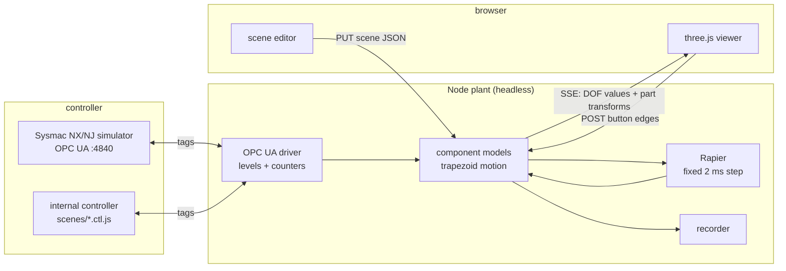
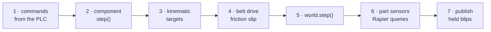

# manufacturing_io

A browser 3D plant simulator for **special purpose machines**, driven by a **real PLC program**.

The plant runs headless in Node (Rapier, fixed 2 ms step). The browser renders, edits and
measures it. The controller is either the **Omron Sysmac NX/NJ simulator over OPC UA**, or a small
internal controller so the scenes run with no PLC installed.


*The `assembler` scene, running on its own PLC program. Every tag the program reads or writes is
on the right, live, and forceable.*

## Quick start

```bash
npm install
node server/main.js --scene assembler --internal    # http://127.0.0.1:7660/
```

Press **Run**, then click the green **START** button in the 3D view. The scene picker and the
Internal/PLC switch change scene or controller without restarting.

```bash
node tests/run.js                                   # the whole suite, no framework
node tools/gen_sysmac.js --scene a-to-b             # scenes/a-to-b.sysmac.xml, to import into Studio
node tools/smc2.js plc/P.smc2 --scene a-to-b        # or straight into a CLOSED project: globals, program, task
node server/main.js --scene a-to-b                  # the same scene against the simulator (opc.tcp://127.0.0.1:4840)
```

## What it does

- **Parts are parametric.** A cylinder takes bore, stroke, acting type and speed; reed switches
  sit at adjustable positions on the tube. A cylinder mounts on a servo slide, a gripper on the
  rod end, and each part moves with whatever it is attached to.
- **Workpieces are real physics.** They fall, ride belts on friction, queue against stoppers, get
  pushed down chutes and trip photo-eyes. Actuators stay kinematic: physics never decides the
  sequence and never writes to the PLC.
- **Jam it on purpose.** Click and hold a part in the 3D view and it stops dead where it is: the
  belt slips under it, the parts behind it queue up, and you watch what the PLC program does about
  it. Drag to move it — out of a gripper, off a belt, back into a nest. A part taken out of a
  holder makes that holder's switch go false, so the machine runs its cycle with an empty gripper
  and has to notice. Forcing a tag lies to the PLC; this breaks the material flow instead.
- **The PLC is the real thing.** Sysmac tags drive the actuators, the plant computes the sensors
  and writes them back. `tools/gen_sysmac.js` writes the ST and the XML for a scene; `tools/smc2.js`
  imports it into a `.smc2` project, task assignment included.
- **Timing is measured, not assumed.** ~39 ms IO round trip at p50 against the Studio 1.66
  simulator, which counts 10 ms pulses. Sensor blips too short for the PLC to see are held and
  reported as warnings.
- **The scene is editable in the browser.** Pick a part in 3D, move it with a gizmo, edit its
  parameters and tags, save. The running plant rebuilds from the saved file.

## Scenes

Seven machines run with their own PLC programs, each in `scenes/<name>.{json,st,ctl.js,sysmac.xml}`.

| scene | what it shows |
|---|---|
| `a-to-b` | loader, belt, end sensor, unloader. The smallest complete cycle |
| `stopper-pusher` | a stopper meters parts at a pusher; odd parts go down a reject chute |
| `pick-place` | a servo traverse with a pneumatic lift and a vacuum cup, 6.5 s per cycle |
| `sort-by-height` | a low beam sees any part, a high beam only the tall ones, which get pushed off |
| `buffer-queue` | a buffer belt stands still between demands and meters out one part at a time |
| `assembler` | a 4-station cam indexer: load a base, drop a lid, press it, index on |
| `pallet-line` | a pallet is fed, stopped by a pop-up stop, lifted off the belt, loaded and released |

| | |
|---|---|
|  |  |
| **`stopper-pusher`** — one part is held at the pusher while the next rides up the belt | **`pick-place`** — a part sits clamped in the nest as the traverse comes back for it |
|  |  |
| **`sort-by-height`** — a tall part runs at the two beams, the pusher waiting by the chute | **`assembler`** — lids ride their bases on friction alone as the table carries them on |

All seven passed a 30-minute soak: cycles keep completing, parts balance, none are lost, and
nothing warns. Step cost was measured for the first six, alone on the box: 69–441 µs against a
1000 µs budget.

## How it fits together



One plant step, in order:



The rules that are invisible in the code but break things silently — why the belt drives by
friction and not by a velocity override, why a stopper is a square block, why a waiting step must
test an invariant and never "a counter moved" — are in [CLAUDE.md](CLAUDE.md), each one measured
and pinned by a test.

## Status

| phase | |
|---|---|
| **P0** OPC UA bridge, latency measured | done |
| **P1** plant, viewer, first scene, live against the simulator | done |
| **P2** browser scene editor | first cut: select, move, edit, save, undo |
| **P3** parts and material flow | six scenes, soaked; pallets and live PLC runs of the newer scenes still open |
| **next** CAD assembly import (STEP / iCAD), then AI-assisted motion setup over MCP | planned |

## Limits

- One driver so far: Omron Sysmac over OPC UA. Modbus TCP and a FUXA HMI come later.
- OPC UA sampling is tens of ms, slower than the PLC scan. A pulse shorter than a round trip can
  be missed, and PLC-measured times include the latency. The plant measures it and warns instead
  of hiding it.
- Actuators are kinematic models by design. Only free workpieces are Rapier-dynamic.
- Two Sysmac Studio steps cannot be automated: enabling the OPC UA server, and Run. The plant
  checks a PLC heartbeat tag and says so when nothing is running.
- No CAD import yet, so machines are built from primitives or in the editor.

## Tests

```bash
node tests/run.js                                   # everything; a skip always prints why
MIO_BROWSER=1 node tests/browser.test.js            # the editor end to end in headless Chrome
```

Rapier's contact traps are pinned as pairs in `tests/rapier.test.js`: the trap, and the rule that
avoids it. Controller races are pinned in `tests/ctl.test.js`, which drives every scene's
controller against a faked plant whose counters move at awkward moments.

## Related

Most of the plumbing was proven first in [rb4axis](https://github.com/Dennych123/rb4axis): the
OPC UA session, the Sysmac XML generator, the smoothing and the test harness. The closest
projects elsewhere are realvirtual WEB (three.js) and the Open Industry Project (Godot); neither
targets SPM parametric pneumatics or Sysmac.

The plan is in [docs/PLAN.md](docs/PLAN.md), the Studio steps in [docs/SETUP.md](docs/SETUP.md),
and the `.smc2` format notes in [docs/SMC2.md](docs/SMC2.md).
